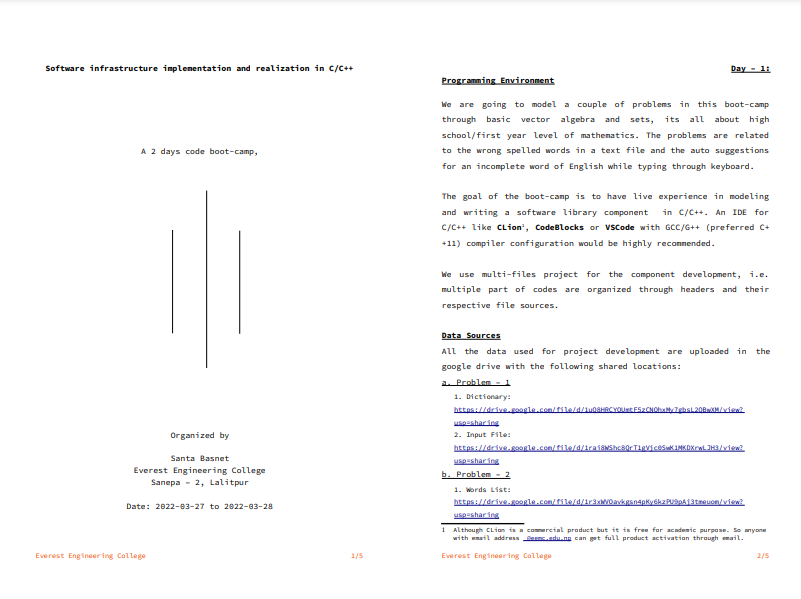
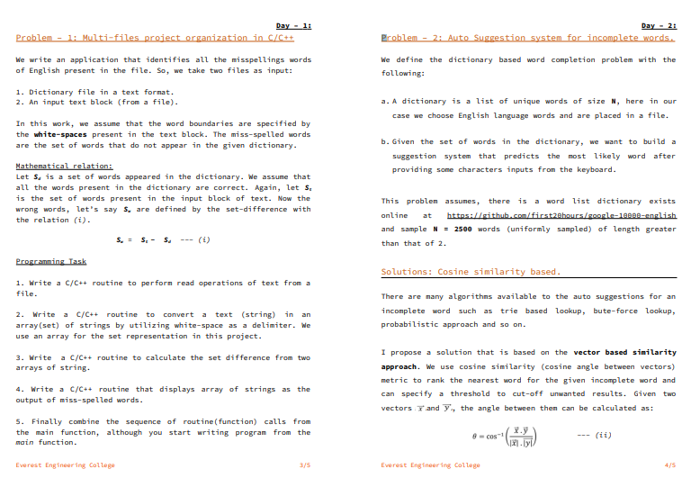
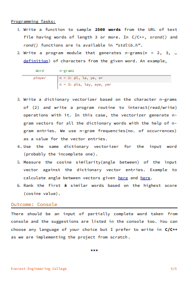

# Code-BootCamp-C-and-CPP

## 🔤 Spell Checker & Auto Suggestion System in C++

This bootcamp implements solutions for two core NLP tasks using basic vector algebra,cosine similarity and set theory. 

  

---

  

---

  

---

## ⚙️ I chose the following programming environment during this bootcamp

- **Language**: C++
- **Compiler**: G++ with C++11 support
- **IDE**: [Visual Studio Code ](https://code.visualstudio.com/download)

>I chose these to learn from scratch and understand concepts properly.

---

## 📁 Data Sources

The required dictionary and input files are available via Google Drive:

### 📌 Problem 1: Misspelled Words Detection
- [Dictionary File](https://drive.google.com/file/d/1uQ8HRCYOUmtF5zCNOhxMy7gbsL2QBwXM/view?usp=sharing)
- [Input Text File](https://drive.google.com/file/d/1rai8WShc8QrT1gVjc0SwK1MKDXrwLJH3/view?usp=sharing)

### 📌 Problem 2: Auto Suggestion System
- [Word List (Sample from Google 10,000 English)](https://drive.google.com/file/d/1r3xWVOavkgsn4pKy6kzPU9pAj3tmeuom/view?usp=sharing)

---

## 🧠 Credits

Bootcamp supervisor : [Er. Santa Basnet](https://github.com/santabasnet)

The effort that has been done by respected supervisor for preparing the entire infrastructure of bootcamp and problems has not only helped me learn the solutions to the problem but rather understand the implication of concepts such as map, vectors and other tools. This has gave me boost in capacity to understand the fundamentals of C and NLP. I have understood the basic building block of NLP that is set theory and vector theory.

I would like to heavily recommend this bootcamp to any one who wants to learn C/C++ or other languages + learn about the implications of NLP and its basics.

>For further details, please go through this [pdf](https://github.com/santabasnet/Code-BootCamp-C-and-CPP/blob/main/bootcamp-eec-doc.pdf).

