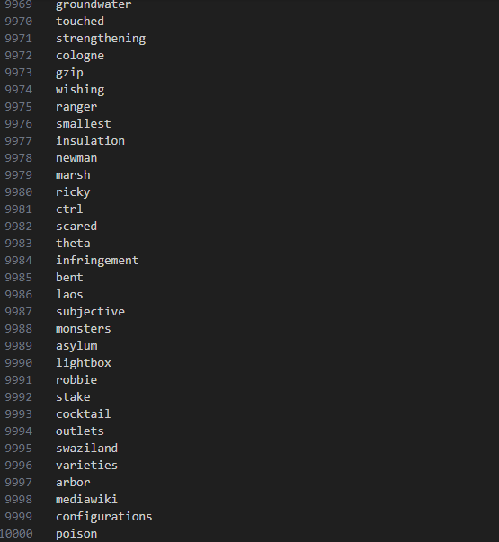
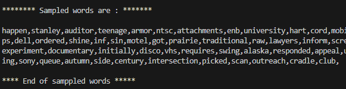
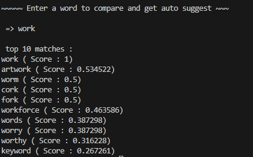
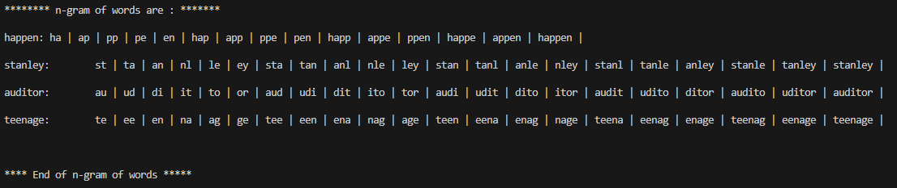
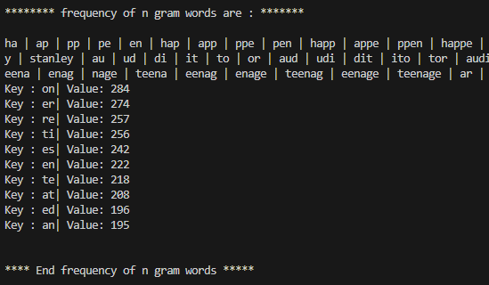

# Auto Suggestion System for Incomplete Words in C++

This problem requires us to use cosine similarity on n-gram vectors to find the best suggestion for the input words so that vectorization and samling of words from dict is integral part of this problem. We follow vector-space model approach among many other methods. Vector approach simply converts the string into numbers that machine can understand. 

> A machine cannot understand "hello" but it can understand [1 0 0 1 0] which is what we convert into during vectorization.

>Cosine similarity utilizes this vectorized value and finds the dot product and norm value of two vectors and calculates the similarity.

>We perform uniform probability sampling to get 2500 out of 10,000 words in the provided dictionary.
---

<p align="center">
  <br>
  <em>Image: 10000 text snippet</em>
</p>

---

<p align="center">
  <br>
  <em>Image: sample text snippet</em>
</p>

---


## Problem Description

The goal is to output all the words (top 10) that are most suitable for the given input word. i.e. highest cosine value are preferred.

This problem has been solved and looks like this. (only 10 taken to not overshadow the entire console)
<p align="center">
  
    
   <em>Image: Input and Output snippet</em>

</p>

---

## Mathematical Model

Let `A` and `B` be n-gram frequency vectors for two words. 

Then:
```math
cos(θ) = (A · B) / (‖A‖ * ‖B‖)
```
Where:
- `·` is the dot product
- `‖A‖` and `‖B‖` are vector magnitudes


This has been done by using the following function:

```bash
double cosineSimilarity(const vector<double> A,const vector<double> B){
    if(A.size() != B.size()){
        cerr<< "Vectors must be the same size"<<endl;
        return 0.0;
    }

    double dot =0.0,normA =0.0,normB=0.0;
    for( size_t i=0;i<A.size();i++){
        dot+=A[i] * B[i];
        normA += A[i]*A[i];
        normB += B[i]*B[i];
    }
    if(normA ==0 || normB ==0) return 0.0;
    return dot/(sqrt(normA)* sqrt(normB));

}

```

---

Uniform sampling probability samply is obtained by using rand() function provided by stdlib of c++.

```bash
vector<string> sampleWords(){
    ifstream fileEng(fileName);
    if(!fileEng) cerr<<"No file of such name found :" <<fileName<<"\n";
    string line;
    vector<string> words;
    while(getline(fileEng,line)){
        words.push_back(line);
    } 
    vector<string> sampledWords;


    srand(time(0));
    int wordsSampled =0;
    vector<int> addedIndex;
    int num;
    while(wordsSampled<2500){

        num = rand() % 10000;
        if(words[num].length() <3) continue;
        if(checkIfExist(num,addedIndex)) continue;
        addedIndex.push_back(num);
        wordsSampled++;
        sampledWords.push_back(words[num]);
    }

    fileEng.close();
    return sampledWords;
}

```

---

The n-grams are made from bi-gram to its definition. It is achieved by implementing the following function after which frequency is also calculated using map.

```bash
vector<string> getSingleGrams(string word){
        vector<string> brokeDownString;
        for(int k=2;k<=word.length();k++){
        for(int i=0;i +k <= word.length();i++){
            
                brokeDownString.push_back(word.substr(i,k));
            }   
        }
        return brokeDownString;
}

//gives n gram from 2 to definition
map<string, vector<string>> getn_grams(vector<string> words){
    map<string, vector<string>> n_grams;
    for(int j=0;j<words.size();j++){
        vector<string> brokeDownString = getSingleGrams(words[j]);
        n_grams.insert({words[j],brokeDownString});
    }

    return n_grams;
}

```

<p align="center">
  
    
<em>Image: ngrams snippet</em>

</p>

<p align="center">
  
    
<em>Image: frequency snippet</em>

</p>

---

Vectorization is another important aspect of this problem. This has been performed on both n grams of dictionary word and also the input words by using the following function:

```bash
vector<double> vectorizeWord(const vector<string> wordNgrams, const map<string, int>& ngramIndex){
    vector<double> vec(ngramIndex.size(),0.0);
    for(const string ng:wordNgrams){
        auto it = ngramIndex.find(ng);
        if(it!=ngramIndex.end()){
            vec[it->second] += 1.0;
        }
    }
    return vec;
} 


```

---


