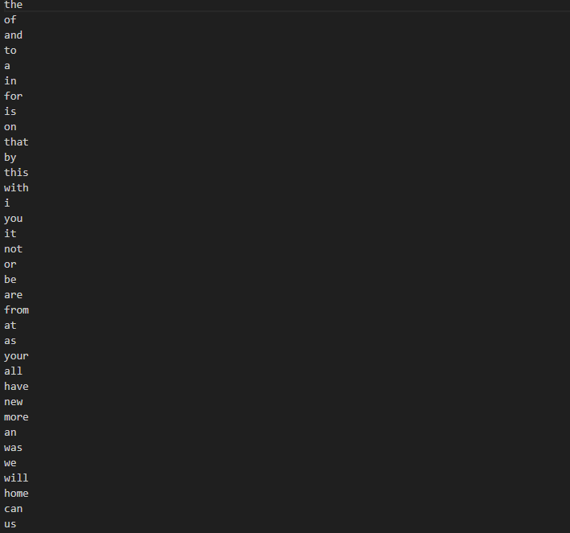

# Misspelled Word Detection in C++

This problem requires us to simply comare input.txt with dictionary.txt to find words in input file which do not have any match to dictionary.txt words. This means it is misspelled. We are doing this with a limited set of words in dictionary and assuming it to be correct words.

---

<p align="center">
  

Image: Dictionary text snippet

---

  

Image: Input text snippet

---

</p>


## Problem Description

The goal is to output all the words from the input text that are not present in the dictionary

This problem has been solved and looks like this. (only 10 taken to not overshadow the entire console)
<p align="center">
  
</p>

---

## Mathematical Model

Let:
- `Sd` = Set of words from the dictionary file  
- `St` = Set of words from the input text  
- `Sw` = Set of misspelled words

Then:
```math
Sw = St - Sd

```


This has been done by using the following function:

```bash
int no_Missed = 0;
vector<string> misSpelled(vector<string> input, vector<string> dict){
    vector<string> words;
    bool found = false;
    for(int i=0;i<input.size();i++){
        for(int j=0;j<dict.size();j++){
            if((input[i]) == dict[j]) {
                found = true;
                break;
            }    
        }
        if(!found){
            words.push_back(input[i]);
            no_Missed++;
        }
        found = false;
    }

    return words;
}
```


